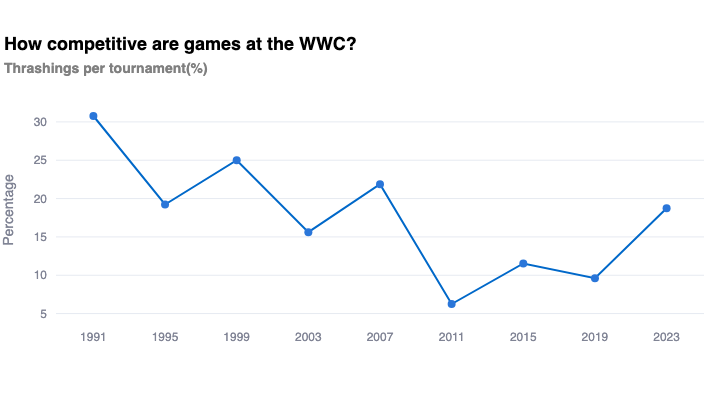
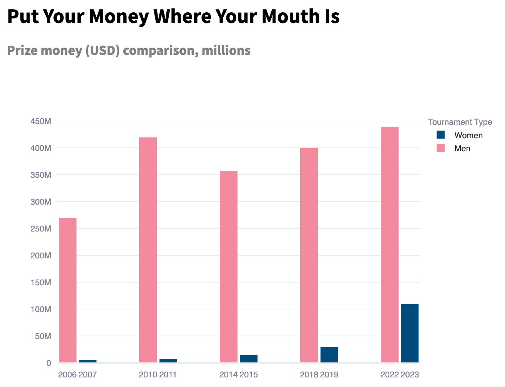

# From Margins to Main Stage: The Rise of Women's Football

> The goal of this project is the creation of a data-driven visual and text narrative that shines the spotlight on the development of women's football globally. I collected Women's
World Cup data through a Kaggle dataset, used web-scraping to collect supplementary match data from FBref, and engaged in extensive personal research and data collection efforts. The accompanying visualisations were produced using Plotly and Matplotlib and are fully interactive.

The full project is available to view via [this link](https://marginstomainstage.streamlit.app/).
 
## Project Overview

The project 
- provides **background and contextual information** about women’s football in the 20th century.
- highlights changes in  **global participation** across time 
- examines **factors behind success**, **performance trends** and **attendance growth** in the WWC, and exposes  **systemic inequalities** which still persist in the women’s game.
- gives the user an **user-friendly interface** for exploring and visualising Women’s World Cup data to uncover surprising facts about the competition.

--- 
Below you will find an abbreviated preview of just 3 of the questions answered in this project:

## 1. What historical challenges has women’s football faced?

Women have been playing football since 1800: just as long as men. However, the disparity in the women’s and men’s professional game, in terms of visibility, investment and global attention, is stark.

In the early 1900s, women’s football was booming - but fast forward just 50 years later, and women were banned for decades from playing in organised league football in many countries across the world.

These bans decimated the women’s game and created an deeply unequal playing field, the effects of which we still see across the women’s football landscape.

## 2. How competitive are games at the WWC?

There are many ways in which competitiveness can be evaluated. Analysing the rate of one-sided games (defined as matches where the goal difference between teams exceeds 3) shows to what extent there exists a level playing field across tournaments.

In the Men’s World Cup, in comparison, no tournament since 1958 has had an equivalent rate of over 10%. It is clear that despite the drop in recent years, whenever WWC tournaments have expanded in size (2015 and 2023), there is a corresponding increase in teams with no established tournament history and very often a lack of institutional support, creating more skewed games. 

## 3. What inequalities still exist in top-level women’s football?

The yawning gap in prize money allocation between the men's and women's World Cups tells its own story about inequality and investment.

Although FIFA President Gianni Infantino has announced a goal to achieve equal prize money by 2027, this throw-away public statement has not been followed up by concrete plans 
on how FIFA aim to make up a 330 million prize gap in just 2 years time.

## Data Sources

- **Kaggle** and **FBref** - Women's World Cup team and match data 
- Prize Money and Manager Data collected from publicly available sources.

## Tech Stack

This app is powered by:

- **Python**: for backend, data manipulation, and webscraping
- **Pandas**: for data cleaning and processing
- **Streamlit**: for the interactive web interface
- **Plotly** and **Matplotlib**: for data visualisations
