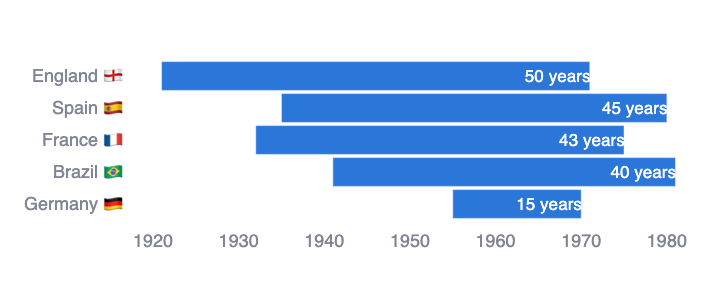

# From Margins to Main Stage: The Rise of Women's Football

> The goal of this project is the creation of a data-driven visual and text narrative that shines the spotlight on the development of women's football globally. I collected Women's
World Cup data through a dataset from Kaggle, and supplemented my analysis via match data from FBref and extensive personal research and data collection efforts. The accompanying visualisations were produced using Plotly and are fully interactive.

The full project is available to view via [this link](https://marginstomainstage.streamlit.app/).
 
## Project Overview

The project 
- provides **background and contextual information** about women’s football in the 20th century.
- highlights changes in  **global and regional participation** across time 
- examines **factors behind success**, **key performance metrics** and **attendance growth** in the WWC, and exposes  **systemic inequalities** which still persist in the women’s game.
- gives the user an **user-friendly interface** for exploring and visualising Women’s World Cup data to uncover surprising facts about the competition.

--- 

Below you will find an abbreviated preview of just 3 of the questions I was able to answer in this project:

## 1. What historical challenges has women’s football faced?

Women have been playing football since 1800: just as long as men. However, the disparity in the women’s and men’s professional game, in terms of visibility, investment and global attention, is stark.

In the early 1900s, women’s football was booming - but fast forward just 50 years later, and women were banned for decades from playing in organised league football in many countries across the world.

These bans decimated the women’s game and created an deeply unequal playing field, the effects of which we still see when it comes to international competition and tournaments.

## Data Sources

- **Kaggle** and **FBref** - Women's World Cup team and match data 
- Prize Money and Manager Data collected from publicly available sources.

## Tech Stack

This app is powered by:

- **Python**: for backend, data manipulation, and webscraping
- **Pandas**: for data cleaning and processing
- **Streamlit**: for the interactive web interface
- **Plotly**: for interactive data visualisations
