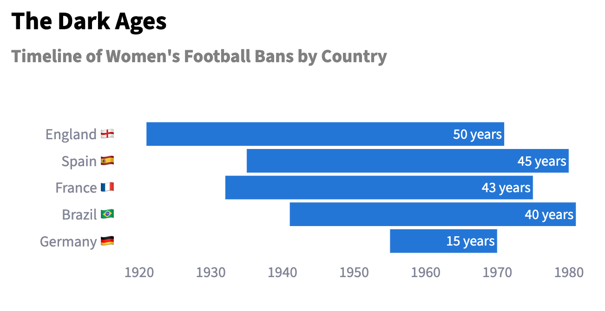

# From Margins to Main Stage: The Rise of Women's Football

This interactive web app, made by Vishaki Vijayakumar, analyzes historical World Cup Data to tell a story of the development of international women's football.

The app is available to view [here](https://marginstomainstage.streamlit.app/).

## Project Overview

The goal of this project is the creation of a data-driven visual and text narrative that shines the spotlight on the development of women's football globally. 

The project 
- provides **background and contextual information** about women’s football in the 20th century.
- highlights changes in  **global and regional participation** across time 
- examines **factors behind success**, **key performance metrics** and **attendance growth** in the WWC, and exposes  **systemic inequalities** which still persist in the women’s game.
- gives the user an **user-friendly interface** for exploring and visualising Women’s World Cup data to uncover surprising facts about the competition.

--- 

Below you will find a very abbreviated preview of just 3 of the questions I was able to answer in this project:

## 1. What historical challenges has women’s football faced?

Women have been playing football since 1800: just as long as men. However, the disparity in the women’s and men’s professional game, in terms of visibility, investment and global attention, is stark.

In the early 1900s, women’s football was booming - but fast forward just 50 years later, and women were banned for decades from playing in organised league football in many countries across the world.

These bans decimated the women’s game and created an deeply unequal playing field, the effects of which we still see when it comes to international competition and tournaments.termin

## Data Sources

- Women's World Cup match data from **Kaggle**
- Additional Women's World Cup data web-scraped from **FBref**.
- Prize Money and Manager Data collected from publicly available sources.

## Tech Stack

This app is powered by:

- **Python**: for backend, data manipulation, and webscraping
- **Pandas**: for data cleaning and processing
- **Streamlit**: for the interactive web interface
- **Plotly**: for interactive data visualisations

## Exploring the app
- **Home page**: Introduction to the project 
- **Historical Overview**: Learn about the contextual background that led up to the first WWC in 1991.
- **Global Participation**: View information about each edition’s competitiors, their placings, and the growth of the competition over time.
- **Performance Metrics**: Discover the tournament’s top finishers and analyse detailed data related to the tournament’s increasing competitiveness
- **Attendance figures**: Find out to what extent public and media interest has grown over time.
- **Equality Drive**: Discover where the women’s game still has to make up ground.

Coming soon:

- **Reference page**: See the sources that made this app possible.
- **Match dashboard**: Visualise statistics around the iconic 2023 World Cup final featuring Spain and England.
- **Iconic moments**: Relive a selection of moments that can truely be called gamechangers in WWC history.
- **Hypothesis testing**: TBA
